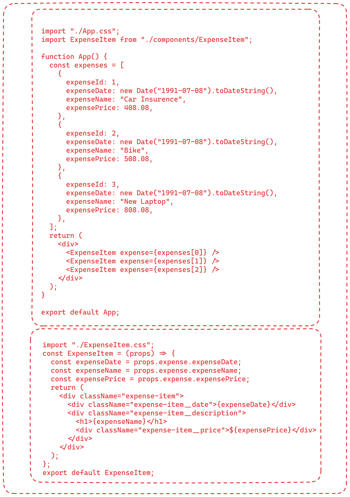
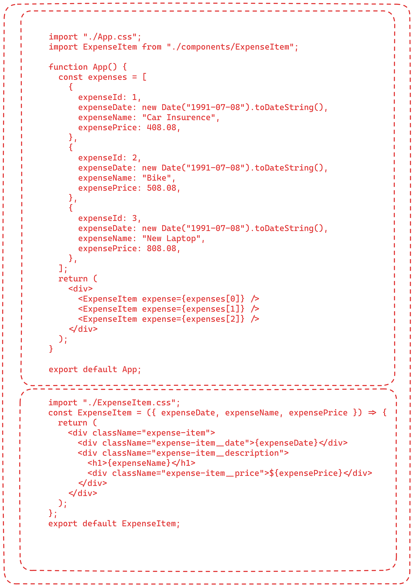
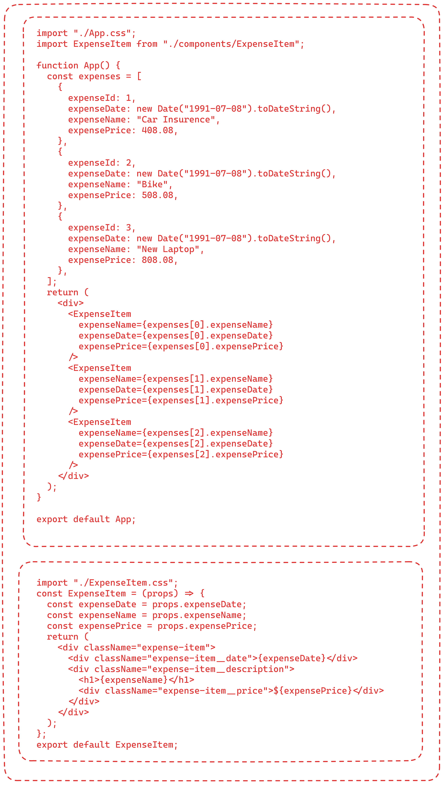
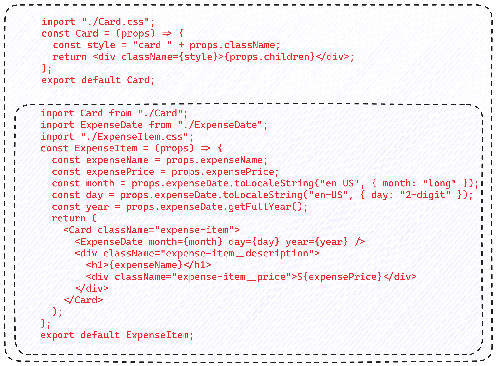

# React Js
## Variable
### Variable is used store some value.
### It can hold any data type value.
## Create variable using let keyword.
### let keyword is used to create variable.
### let name = "Shiva";
### It improves reusability.
## Create variable using const keyword.
### const keyword is used to create variable.
### const name = "Shiva";
### main difference between let and const is we can not reassign value to const variable.
### Different type of values
### String
### Number
### Boolean
### null & undefined

## Functions
### Functions are used to do some work on alling them.
### it takes parameters and rtuen some value.

## Arrays
### Holds multiple values

## # Array Destructuring

## React basics
## What is component
### Component is re-usable entity just like pugguable , acts as individual building blocks.
### Reuseability and seperate of concerns.
### Split big application into small reuseable parts.
### A component build using HTML,CSS,Javascript.
## JSX
### JavaScript XML
## How React Works
### There shold be only one root element for return statement.
## Props
### Props are attributes of components.
### Props are used to pass data from one component to other.
### Components with props makes components acts more dynamic
## Passing object through props from one component to other component. 

## Passing object from one component to other component using object destructuring. 

## Passing data as individual properties from one component to other component using props.
 
## DOM
### Document Object Model
## Virtual DOM
### Is a javascript object, light weight representation of DOM
### Updating virtual DOM is much faster than updating real DOM 
### So when there is change in page virtual DOM updates component that has changes, instead of updaing entair page by comparing old and new virtual DOM.
## Component Composition
### We can pass other component as child to different component.
 
## State
### State used to register some value in the component and modify them 
## Lifting state up
## Derrived - Computed state
### Value that is derrived from state is called derrived state